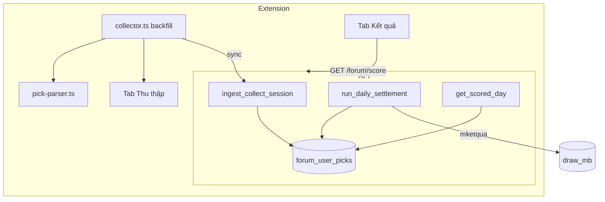

# Design: Forum Collect → Score Pipeline v1

## Mô hình nghiệp vụ (đã thống nhất)

```
┌─────────────────────────────────────────────────────────────────────────┐
│  TAB THU THẬP — tạo INPUT                                                │
│  crawl forum → parse picks → session.posts → (auto) sync API             │
└───────────────────────────────┬─────────────────────────────────────────┘
                                │ POST /forum/picks
                                ▼
┌─────────────────────────────────────────────────────────────────────────┐
│  SERVER — lưu & chuẩn hóa                                                │
│  forum_sessions (JSONB)  →  ingest  →  forum_user_picks (dedupe)         │
└───────────────────────────────┬─────────────────────────────────────────┘
                                │ run_daily_settlement (18:31+ hoặc manual)
                                ▼
┌─────────────────────────────────────────────────────────────────────────┐
│  TAB KẾT QUẢ — so KQXS với INPUT (KHÔNG crawl forum)                     │
│  import mketqua → pick_hit(each row in forum_user_picks) → UI            │
└─────────────────────────────────────────────────────────────────────────┘
```

Tab Kết quả **đúng** khi so sánh KQXS với pick đã thu thập. Tab Kết quả **sai** khi user kỳ vọng nó quét toàn bộ forum mà Thu thập chưa đủ.

## Root cause (audit 2026-07-04)

```
Thread thao_luan (17 pages khi audit, 10 pages lúc crawl)
│
├── Poll cycle 1: fetch page 10 (last) ──► posts 3919956+
├── Backfill: 9 → 8 ──► dừng (chưa tới page 7, 3)
├── 18:30 finalize ──► sync ──► ingest ──► score
│
└── Pick Duong145 (p3), Tornado (p7) ──► KHÔNG BAO GIỜ vào session
```

| Lỗ hổng | Hệ quả |
|---------|--------|
| `MAX_PAGES_PER_CYCLE` + cooldown 5 phút | Nhiều cycle mới backfill xong; finalize có thể chặn trước |
| `last_page_fetched` không refresh khi thread phình | Bỏ sót post mới trên page > last |
| Finalize không check `backfill_complete` | Sync snapshot thiếu |
| Parser `27.72`, `4 số` | Pick có trong session nhưng không vào `forum_user_picks` |
| Không có coverage UI | User không biết input chưa đủ |

## Kiến trúc mục tiêu



## Quyết định thiết kế

### D1 — Backfill là bắt buộc cho thread thảo luận ngày

Thread `thao_luan` / `mo_bat` daily SHALL đạt `backfill_complete=true` khi:

- `lowest_page_fetched === 1`, **hoặc**
- Trang `lowest_page_fetched` có `min(posted_at) < collect_window_start` (post cũ hơn cửa sổ → các trang trước chắc chắn ngoài cửa sổ)

Mỗi poll cycle SHALL:

1. Re-read `last_page` từ HTML (thread có thể tăng trang sau giờ quay).
2. Fetch last page (post mới nhất).
3. Backfill từ `lowest_page_fetched - 1` xuống, tối đa `MAX_PAGES_PER_CYCLE` (giữ 25, có thể tăng cho `force`).

**State mở rộng** (`session.threads[key]`):

```ts
{
  last_page_fetched: number;
  lowest_page_fetched: number;
  backfill_complete: boolean;
  pages_fetched_total?: number;  // cumulative audit
}
```

### D2 — Finalize có gate backfill

| Điều kiện | Hành vi |
|-----------|---------|
| `shouldFinalize` && mọi daily thread `backfill_complete` | Finalize + sync như hiện tại |
| `shouldFinalize` && còn thread chưa backfill | **Defer finalize** — tiếp poll backfill ưu tiên; UI `collect_status: backfilling` |
| Defer > 30 phút sau 18:30 (config `BACKFILL_FINALIZE_GRACE_MS`) | Finalize với `coverage_warning: true` |

Chăn nuôi (thread dài hạn): backfill theo timestamp trong cửa sổ, không bắt buộc tới page 1.

### D3 — Parser: tách pick gốc vs quote

Trước khi parse, strip XenForo quote blocks:

- Pattern: `Username nói:`, `Click to expand`, `<blockquote class="bbCodeBlock--quote">` (HTML path)
- Nếu sau strip còn < 15 ký tự hoặc chỉ còn quote → `picks: {}`

**Format mới (parity extension + Python):**

| Input | Output |
|-------|--------|
| `STL : 27.72` | `stl: ['27','72']` |
| `STL : 27,72` | `stl: ['27','72']` (giữ) |
| `4 số : 14,41,78,87` | `std_de` hoặc `de_4so: ['14','41','78','87']` (map vào pick type đề hiện có) |
| `1 số : 14` | `btd_de: ['14']` nếu ngữ cảnh đề |

### D4 — Ingest contract (không đổi dedupe, bổ sung metadata)

`POST /forum/picks` response SHALL include:

```json
{
  "ok": true,
  "target_date": "2026-07-04",
  "pick_count": 75,
  "post_count": 129,
  "coverage": {
    "threads": [
      {
        "key": "thao_luan",
        "backfill_complete": true,
        "lowest_page_fetched": 1,
        "last_page_fetched": 17
      }
    ]
  }
}
```

Ingest SHALL replace `forum_user_picks` cho `target_date` (giữ hành vi hiện tại) — mỗi sync là snapshot đầy đủ hơn.

### D5 — Settlement sequence

```
18:31 ICT (hoặc user bấm Chấm lại):
  1. import_draw_for_day (mketqua)
  2. forum_repo.get_user_picks(target_date)
  3. _dedupe_before_cutoff (posted_at < 18:00 ICT)
  4. pick_hit → expert_pick_results
  5. refresh rolling_90d (existing)
```

`GET /forum/score` SHALL merge:

- `results` từ `expert_pick_results`
- `coverage` từ `forum_sessions.payload.threads` (nếu có)
- `draw` từ `draw_mb`

### D6 — UI minh bạch

**Tab Thu thập** — mỗi thread daily:

```
thao_luan: trang 8/17 ↓ đang backfill
mo_bat: ✓ đủ (page 1)
```

**Tab Kết quả** — footer hint:

```
Chấm 75 pick từ Thu thập (129 post). Thảo luận: backfill 8/17 — có thể thiếu pick sớm.
```

Nếu `coverage.threads[].backfill_complete === false` → badge vàng, không đỏ (không phải lỗi chấm).

## File touch map

| File | Thay đổi |
|------|----------|
| `extension/src/lib/collector.ts` | D1, D2: refresh last page, finalize gate |
| `extension/src/lib/pick-parser.ts` | D3 |
| `app/services/forum_crawl_service.py` | D3 parity |
| `app/services/forum_ingest_service.py` | D4 coverage in response |
| `app/services/expert_score_service.py` | D5 coverage in get_scored_day |
| `extension/src/popup/popup.ts` | D6 UI |
| `scripts/audit_collect_score.py` | Audit |
| `tests/test_pick_parser_*.py` | Parser cases |
| `tests/test_collector_backfill.py` | Backfill stop conditions |

## Rủi ro & giảm thiểu

| Rủi ro | Giảm thiểu |
|--------|------------|
| Thread rất dài (>30 trang) | Stop at window start, không cần page 1 |
| Rate limit forum | Giữ cooldown; `force` poll tăng `MAX_PAGES_PER_CYCLE` |
| Finalize trễ | Grace 30 phút rồi finalize + warning |
| Quote strip quá tay | Test với post thật; chỉ strip block quote XenForo |

## Verification plan (ngày 2026-07-04)

1. `force` poll thread `101405` đến `backfill_complete`.
2. Sync → verify post_id `3919403`, `3919872`, `3920151` trong session.
3. `POST /forum/score/run?target_date=2026-07-04`.
4. Assert score rows: Duong145 `stl` hit, Tornado6789 `btl` hit, 36QueToi `stl` hit.
5. `audit_collect_score.py --date 2026-07-04` — 0 missing STL/BTL winners trong cửa sổ.
